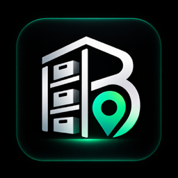

<p align="center"></p>

# BinTrack — Multi-Warehouse Inventory & Location Tracking (Supabase)

> **PS-3 · Pure Hard Development**
> Orders come in but staff don't immediately know which warehouse, row, or bin holds the item.
> BinTrack answers "where is it and how many are there?" in under a second, verifies every pick with a barcode/QR scan, and keeps admins informed through a live, alert-driven dashboard.

---

## 1. What is in this repository

| Path | Purpose |
|---|---|
| `README.md` | This file. Overview, quick start, feature list, document index. |
| `docs/01-PRD.md` | Product Requirements Document — problem, personas, features, user stories, acceptance criteria, success metrics. |
| `docs/02-TRD.md` | Technical Requirements Document — architecture, stack, Supabase services, API/RPC contracts, realtime, security, performance, testing. |
| `docs/03-APP-FLOW.md` | App flow — screen map, navigation, and step-by-step flows for every feature (auth, search, order intake, pick verification, alerts, CSV, expiry). |
| `docs/04-UI-UX-DESIGN.md` | UI/UX design system — minimal theme tokens for light & dark mode, typography, components, layouts, wireframes, accessibility. |
| `docs/05-IMPLEMENTATION-PLAN.md` | Phased implementation plan with tasks, milestones, folder structure, definition of done, and risk register. |
| `docs/06-FEATURE-IDEAS.md` | Extended feature catalogue (must-have, should-have, nice-to-have) beyond the original problem statement. |
| `supabase/config.toml` | Local Supabase configuration — ports, buckets, auth, per-function JWT rules. |
| `supabase/migrations/0001_schema.sql` | Backend schema — tables, enums, indexes, views, functions/RPCs, triggers, RLS policies, realtime publication. |
| `supabase/migrations/0002_grn.sql` | Goods-receipt module — vendors, purchase orders, GRNs, lines, put-aways, documents, timeline; RPCs, RLS, storage bucket. |
| `supabase/seed.sql` | Deterministic mock data generator — 1 warehouse, 4 rows, 160 bins, 800 SKUs, stock, expiry lots, sample orders. |
| `supabase/functions/` | Edge Functions: `csv-import`, `alert-digest`, `label-pdf`, `order-webhook`, plus `_shared/` and Deno tests. |
| `supabase/tests/` | pgTAP suites — RLS (`001`), movement invariants (`002`), FEFO allocation and scan verification (`003`), goods receipt end to end (`004`), warehouse status + staff tasks + performance (`005`). |
| `supabase/templates/` | Downloadable CSV templates for each import kind. |
| `web/` | The React 18 + Vite + TypeScript app — every screen in the app-flow document. |
| `.github/workflows/ci.yml` | CI: lint, typecheck, unit tests, build, `supabase db lint`, pgTAP, Deno checks. |
| `.env.example` | Environment variables for the app and the Edge Functions. |
| `DESIGN.md` | The design system the UI tokens derive from (Binance analysis, via `getdesign`). Edit this, then mirror changes into `globals.css`. |

---

## 2. Feature summary

### Core (from problem statement)
- **Location hierarchy** — Warehouse → Row → Bin, unique `location_code` per bin (e.g. `WH1-R02-B017`).
- **Product-to-bin mapping** — live quantity per product per bin (per lot / expiry).
- **Order intake** — create an order; the system instantly returns the exact row/bin(s) to pick from (FEFO-aware).
- **Stock movement log** — inward / outward / transfer / adjustment with actor, timestamp, reference.
- **Instant search** — type a product name/SKU/barcode; see every location and quantity.
- **Admin dashboard** — stock overview by row, low-stock alerts.

### Added in this build
- **Smart alert system** — rule engine (low stock, out of stock, expiring soon, expired, dead stock, bin over-capacity, pick discrepancy) delivering in-app notifications to the admin dashboard in real time via Supabase Realtime.
- **QR / barcode scanner verification** — camera-based scanning (bin QR + product barcode) to verify each pick, each put-away, and each transfer. Wrong bin or wrong product is blocked.
- **Expiry management** — expiry date captured on inward stock, FEFO allocation, expiry timeline, quarantine of expired lots.
- **Live dashboard** — all KPIs, row heat-map, and alert feed update over WebSockets (Supabase Realtime: Postgres Changes + Broadcast).
- **CSV bulk import / export** — products, opening stock, bins; validated with row-level error reports; export any grid.
- **Role-based access control** — `inventory_admin` and `staff` roles enforced by Postgres Row Level Security, not just UI.
- **Label printing** — QR labels for bins and barcode labels for products.
- **Cycle counting** — scan-driven stock audits with variance reports.
- **Pick lists with route ordering** — bins ordered by row → bin for a shortest walking path.
- **Goods receipt (GRN)** — PO → truck arrival → seal check → per-SKU verification by scan → GRN → put-away → inventory. Partial deliveries, multiple GRNs per PO, automatic short/excess, wrong-SKU blocking, damaged/rejected stock kept out of inventory, evidence uploads, a five-figure admin dashboard and a full timeline.

See `docs/06-FEATURE-IDEAS.md` for the full extended catalogue.

---

## 3. Tech stack (all free / open-source tiers)

| Layer | Choice | Why |
|---|---|---|
| Database | **Supabase Postgres** | Relational integrity, RLS, RPC via PL/pgSQL, `pg_trgm` for instant search, `pg_cron` for alert sweeps. |
| Auth | **Supabase Auth** | Email/password + magic link; JWT carries role claim for RLS. |
| Realtime | **Supabase Realtime** (WebSockets) | Postgres Changes for stock/alerts, Broadcast for dashboard KPIs, Presence for "who is picking". |
| Serverless | **Supabase Edge Functions** (Deno/TypeScript) | CSV import parsing, alert email digests, label PDF generation. |
| Storage | **Supabase Storage** | CSV uploads, product images, generated label PDFs. |
| Frontend | **React 18 + Vite + TypeScript** | Fast dev loop; SPA suits a scanner-heavy internal tool. |
| UI | **Tailwind CSS + shadcn/ui + lucide-react** | Minimal, themeable, accessible; native dark mode. |
| Data | **TanStack Query + supabase-js v2** | Caching, optimistic updates, realtime cache invalidation. |
| Scanner | **@zxing/browser** (fallback: `html5-qrcode`) | QR + 1D barcodes from device camera; also supports USB HID scanners (keyboard wedge). |
| CSV | **PapaParse** | Streaming parse of large files in the browser. |
| Charts | **Recharts** | Lightweight dashboard charts. |
| Testing | **Vitest, React Testing Library, Playwright, pgTAP** | Unit, component, e2e, and database-level policy tests. |

> Node.js/Express is **not required**: Supabase Postgres RPCs + Edge Functions replace the custom API server. An optional Express gateway is described in the TRD if you need one for hosting constraints.

---

## 4. Quick start

### Prerequisites
- Node.js 20+
- A free Supabase project (https://supabase.com) **or** Supabase CLI for local dev (`npm i -g supabase`)
- Docker (only for local Supabase)

### 4.1 Backend (Supabase)
```bash
# Local
supabase init            # if not already initialised
supabase start           # starts Postgres, Auth, Realtime, Storage, Studio locally
supabase db reset        # applies supabase/migrations/*.sql then supabase/seed.sql

# Hosted
supabase link --project-ref <your-project-ref>
supabase db push         # applies migrations
psql "$SUPABASE_DB_URL" -f supabase/seed.sql   # load mock data
```

Enable in the Supabase dashboard (Database → Extensions): `pg_trgm`, `fuzzystrmatch`, `pgcrypto`, `pg_cron` (hosted only), `uuid-ossp`. The migration also runs `create extension if not exists` for each.

**Local dev logins** (created by `seed.sql` on local Supabase only):

| Email | Password | Role |
|---|---|---|
| `admin@bintrack.dev` | `Password123!` | inventory_admin |
| `staff@bintrack.dev` | `Password123!` | staff |

**Seed output** (deterministic, `setseed(0.42)`): 1 warehouse · 4 rows · 160 bins · 10 categories · 800 SKUs · ~1,500 stock lots (perishables with lot + expiry, some expired / expiring) · ~1,560 movements · 40 orders (15 shipped, some short, some with scan mismatches) · ~230 live alerts across all 8 types.

### 4.2 Create the first admin
1. Sign up a user via the app (or Auth → Users in Studio).
2. Promote them:
```sql
update public.profiles set role = 'inventory_admin' where email = 'admin@example.com';
```
All subsequent users default to `staff`; admins can change roles in **Settings → Users**.

### 4.3 Frontend
The app is built; you only need to point it at your Supabase project.

```bash
cd web
npm install
cp ../.env.example .env.local   # fill in VITE_SUPABASE_URL / VITE_SUPABASE_ANON_KEY
npm run dev                     # http://127.0.0.1:5173
```

Sign in with the seeded accounts below. An admin lands on `/admin`, staff on `/`.

### 4.4 Edge Functions
```bash
supabase functions serve --env-file supabase/.env.local   # local
supabase functions deploy csv-import alert-digest label-pdf order-webhook
```
`alert-digest` no-ops without `RESEND_API_KEY`, and `order-webhook` returns 503 without
`ORDER_WEBHOOK_SECRET`, so neither blocks local development.

### 4.4b Deploying the frontend to Vercel
`vercel.json` at the repo root builds `web/` and serves it as an SPA, so the project
deploys from the root with no dashboard configuration (alternatively set **Root
Directory** to `web` and delete the file).

Note that Vercel validates this file with `additionalProperties: false` — it rejects
any key it does not recognise, including JSON-comment tricks like `"// note"`. Keep
explanations here rather than in the config.

Set these in **Settings → Environment Variables** for every environment you deploy:

| Variable | Value |
|---|---|
| `VITE_SUPABASE_URL` | your project base URL, e.g. `https://<ref>.supabase.co` — **not** a `/rest/v1/` path |
| `VITE_SUPABASE_ANON_KEY` | the anon key (safe in the browser; every table is RLS-protected) |

`web/.env.local` is git-ignored, so it never reaches Vercel — without those two
variables the build now fails with an explicit message rather than deploying a
bundle that white-screens. `vite.config.ts` also rejects a URL that carries a
service path, which is the easiest mistake to make when copying from the Supabase
dashboard.

Only `VITE_*` variables are exposed to the browser. The service-role key, the
Resend key and the webhook secret belong to the Edge Functions
(`supabase secrets set`), never to the frontend.

### 4.5 Checks
```bash
cd web
npm run lint          # eslint, zero warnings
npm test              # vitest — unit and component
npm run build         # typecheck + production bundle + PWA assets
npm run test:e2e      # playwright (needs a running Supabase and dev server)

# from the repo root
supabase test db                                    # pgTAP suites
deno test --allow-env supabase/functions/tests/     # Edge Function unit tests
```

---

## 5. Roles at a glance

| Capability | `staff` | `inventory_admin` |
|---|:--:|:--:|
| Search products / view locations | ✅ | ✅ |
| Create orders, view pick list | ✅ | ✅ |
| Scan-verify picks, confirm outward | ✅ | ✅ |
| Inward stock (receive) with expiry | ✅ | ✅ |
| Transfer stock between bins | ✅ | ✅ |
| Stock adjustments (write-off, correction) | ❌ | ✅ |
| Create/edit products, bins, rows | ❌ | ✅ |
| CSV bulk import / export | export only | ✅ |
| Admin dashboard, alerts, acknowledge | ❌ | ✅ |
| Cycle count approval | ❌ | ✅ |
| Manage users & roles, settings | ❌ | ✅ |

Enforced in Postgres via RLS + `SECURITY DEFINER` RPCs that check `auth.role_of(auth.uid())`.

---

## 6. Key design decisions

1. **Stock is stored per (product, bin, lot, expiry)** — one row per physical lot. Quantity is never edited directly; every change goes through `fn_record_movement`, which writes the movement log and updates stock in one transaction.
2. **Allocation is a database function** — `fn_allocate_order` runs FEFO (first-expired-first-out) then bin route order, and locks rows (`FOR UPDATE SKIP LOCKED`) so two staff can't pick the same unit.
3. **Alerts are derived, deduplicated, and stateful** — the rule engine upserts an `active` alert per (type, product, bin); it auto-resolves when the condition clears. The dashboard subscribes to the `alerts` table.
4. **RLS is the security boundary** — the anon key is safe to ship in the browser because every table has policies; the service role key is used only inside Edge Functions.
5. **Scanning is verification, not data entry** — a pick is `verified` only when scanned bin code == expected bin AND scanned barcode == expected product.

---

## 7. Document index
- [Product Requirements](docs/01-PRD.md)
- [Technical Requirements](docs/02-TRD.md)
- [App Flow](docs/03-APP-FLOW.md)
- [UI / UX Design System](docs/04-UI-UX-DESIGN.md)
- [Implementation Plan](docs/05-IMPLEMENTATION-PLAN.md)
- [Extended Feature Ideas](docs/06-FEATURE-IDEAS.md)
- [Database Schema](supabase/migrations/0001_schema.sql)
- [Seed Data](supabase/seed.sql)

## 8. Screen map

Every route in `docs/03-APP-FLOW.md` is implemented.

| Route | Who | What it does |
|---|---|---|
| `/login`, `/signup`, `/forgot-password` | anyone | `/login` opens as a landing view over the warehouse photograph (`web/public/images/`); **Log in** blurs it and brings the form forward. A guard redirect or `?form` skips straight to the form. Password or magic-link sign in; new accounts start as staff. |
| `/` | staff, admin | Quick actions, orders waiting to be picked, recent movements. |
| `/search` | staff, admin | Typo-tolerant search with every location, quantity and expiry. |
| `/products/:id` | staff, admin | KPI strip, locations table (FEFO order), movement history, admin adjustments. |
| `/bins/:id` | staff, admin | Bin contents, utilisation, value; receive/transfer shortcuts. |
| `/orders`, `/orders/new`, `/orders/:id` | staff, admin | Order list, multi-line intake with paste-SKUs, pick list grouped by row with scan verification and presence. |
| `/receive` | staff, admin | Inward stock with lot and expiry, put-away suggestions. |
| `/grn`, `/grn/new`, `/grn/:id` | staff, admin | Goods receipts: register a truck against a PO (vehicle, driver, seal, challan, invoice), count each SKU by scan, verify, put away into bins, attach evidence, read the timeline. Admins see the KPI strip. |
| `/transfer` | staff, admin | Source bin → lot → destination bin. |
| `/scan` | staff, admin | Full-page scanner hub resolving bins and products. |
| `/movements` | staff, admin | The audit trail: filters, infinite scroll, CSV export. |
| `/counts/:id` | staff, admin | Scan-driven count entry, blind or open. |
| `/profile`, `/more` | staff, admin | Name, theme, digest opt-in, password; mobile overflow menu. |
| `/admin` | admin | Live dashboard — 8 KPIs, stock by row, bin heat-map, alert feed, orders in progress, expiring soon. |
| `/admin/alerts` | admin | Alert centre: tabs, filters, acknowledge / snooze / resolve, bulk actions. |
| `/admin/products`, `/admin/products/new`, `/admin/products/:id/edit` | admin | Catalogue with live stock; product form with live SKU/barcode uniqueness. |
| `/admin/purchase-orders` | admin | Raise POs (vendor, warehouse, lines), see received vs ordered, jump to the truck registration, close a fulfilled PO. |
| `/admin/locations` | admin | Warehouse → row → bin tree, bulk bin ranges, capacity, activation. |
| `/admin/expiry` | admin | Urgency buckets, weekly chart, write-offs. |
| `/admin/counts` | admin | Create, monitor, review variances, approve (posts corrections). |
| `/admin/import`, `/admin/export` | admin | Four-step CSV import with live progress; export of every reporting view. |
| `/admin/labels` | admin | Bin QR and product barcode PDF sheets. |
| `/tasks` | staff | Written tasks from the admin, live: start, finish with a note; priority and due dates; links to the order / GRN / product / bin the task is about. |
| `/admin/staff` | admin | Warehouse open/closed switch, staff performance dashboard (picks, accuracy, receipts, put-aways, tasks, share of work vs fair share), assign tasks in writing (auto-assigns to the least-loaded person), re-balance open work. |
| `/admin/users`, `/admin/settings` | admin | Roles with typed confirmation; alert thresholds, picking options and warehouse hours (10:00–19:00 by default, open days, closed message). |

---

## 8b. Goods receipt (GRN) module

Added in `supabase/migrations/0002_grn.sql`. It reuses the existing systems rather than duplicating them:

| Concern | How the module does it |
|---|---|
| Inventory | Only `putaway_grn_line()` raises stock, and it does so by calling the existing `record_movement('inward', …, reference_type 'grn')`. Damaged and rejected units never reach that call. |
| Discrepancies | The existing alert engine: a new `grn_discrepancy` alert type, keyed by GRN (the dedupe index gained a `grn_id` column, and `upsert_alert()` an optional ninth argument — existing callers are unaffected). |
| Roles | The same `profiles` / `require_active()` / `require_admin()` / RLS pattern. Staff receive, count, verify and put away; only admins raise POs, resolve discrepancies and cancel. |
| Audit | `audit_row_change()` on the new tables, `stock_movements` for every put-away (with `performed_by` and the GRN reference), and a per-GRN `grn_events` timeline that is insert-only. |

**Flow:** `create_purchase_order` (admin) → `create_grn` (truck, driver, seal, challan, invoice; staff recorded from the session; a broken or missing seal raises the alert immediately) → `record_grn_line` per SKU by barcode/SKU (accepted + damaged + rejected must equal received; perishables need an expiry; a product not on the PO is returned as `wrong_sku` and logged, never received) → `verify_grn` (issues the GRN, computes short/excess, updates the PO, raises the discrepancy alert) → `putaway_grn_line` per bin (inventory rises by exactly the accepted quantity; the GRN completes when every accepted unit is in a bin).

**Numbers** are generated: `PO-YYYY-#####`, `GRN-YYYY-#####`. Partial deliveries and several GRNs per PO are normal — a second GRN snapshots what earlier trucks already brought as *previously received*. Completed GRNs cannot be deleted (no delete policy, plus a trigger).

**Evidence** goes to the private `grn-documents` bucket; the detail page flags a seal photo as needed when the seal was not intact, and a damage photo when anything was damaged or rejected.

## 9. Validation status

### Database — verified by running it
`supabase/migrations/0001_schema.sql` and `supabase/seed.sql` were applied end-to-end on PostgreSQL 15.19 (with a shim emulating Supabase's `auth`/`storage` schemas and roles), and the assertions in `supabase/tests/` were executed against that database:

- Migration + seed apply cleanly and produce exactly the documented data: **1 warehouse · 4 rows · 160 bins · 800 products · 1,503 stock lots · 1,564 movements · 40 orders · 117 pick tasks · 239 alerts across all 8 alert types**.
- **141 assertions pass** — 18 RLS (`001`), 20 movement invariants (`002`), 21 allocation and scan verification (`003`), 31 warehouse status, task assignment, fair distribution and performance (`005`), 51 goods receipt (`004`: the spec's worked example, *ordered 100 / received 98 / accepted 96 / damaged 2 / short 2*, ends with inventory up by exactly 96; wrong SKU blocked and logged; broken seal alerts; second partial truck sees 98 previously received; completed GRN undeletable).
- Invariants hold: no `reserved > quantity`, no negative quantities, no expired lot left `available`, reservations equal open pick-task quantities, every `location_code` matches `WH-ROW-BIN`.
- FEFO proven where it matters: with the soonest-expiring lot deliberately placed in the *farthest* row, allocation still consumes it first, while the pick list is still ordered for the shortest walk.
- No oversell: a competing order for the same SKU is `partially_allocated` with the shortfall recorded as a short task, never promised twice.
- Scan verification: wrong bin → `bin` mismatch, wrong barcode → `product` mismatch, mismatches counted, correct pair → `verified`, and confirming decrements the bin.
- Search: `"bleu mug"` → *Family Blue Ceramic Mug*, `"greek yogrt"` → *Pro Green Greek Yogurt*, `"wireles mous"` → *Eco Red Wireless Mouse*, exact barcode → exact SKU. **15–20 ms** for 800 SKUs.

### Frontend — verified by building and running it
- `npm run lint` — clean, zero warnings.
- `npx tsc --noEmit` — clean, for both the app and the e2e project; no `any` at an RPC call site.
- `npm test` — **66 tests pass**, including a jsdom smoke suite that mounts the real `App` (providers, router, shell, lazy pages) and proves the guards and the new screens: a visitor is bounced to sign-in, staff reach `/tasks`, admins get `/admin/staff` with the open/closed switch, staff see the warehouse nav but not the admin section, an admin sees both plus the alert bell, and staff hitting `/admin/products` are redirected instead of shown the catalogue.
- `npm run build` — production bundle with route-level splitting; the scanner (442 kB) and charts (372 kB) load only on the screens that use them, and the PWA service worker and icons are generated.

### Not yet run here
- **Playwright e2e** (`web/e2e/`) is written but needs a live Supabase and a browser download; CI runs it. The five specs cover auth and role guards, search, order intake → scan-verified pick (including the wrong-bin refusal), cross-context realtime, and accessibility basics.
- **`supabase test db`** needs Docker. The five pgTAP files were instead executed statement-by-statement against the local PostgreSQL 15 described above — all 141 assertions pass — so the SQL and the expectations are both known-good; CI runs them through the real pgTAP harness.
- **Deno tests** for the Edge Functions are written; Deno was not installed on this machine, so the pure CSV parser was transpiled and its 7 assertions verified under Node instead. CI runs `deno test` and `deno check`.

### One deviation from the TRD
`docs/02-TRD.md` specifies Postgres 15. `supabase/config.toml` sets `major_version = 17`, because that is what the Supabase CLI v2 provisions for a new project and `major_version` must match whatever your hosted project runs. Nothing in the schema is version-specific — it was verified on 15 and runs on 17 — so if your remote project is on 15, change that one line back.

### One behaviour worth knowing
`record_movement()` raises `bintrack.internal` with a **transaction-scoped** `set_config`, so within a transaction that has already made a legitimate movement, the immutability and stock-guard triggers stop firing. This is harmless in production — every PostgREST request is its own transaction, and RLS grants no `UPDATE`/`DELETE` on `stock_movements` or `stock_levels` to anyone — and `002_movements.sql` asserts both the trigger (in a clean transaction) and the RLS boundary (zero rows affected, even for an admin).

## 10. License
MIT — free for hackathon, academic, and commercial use.
