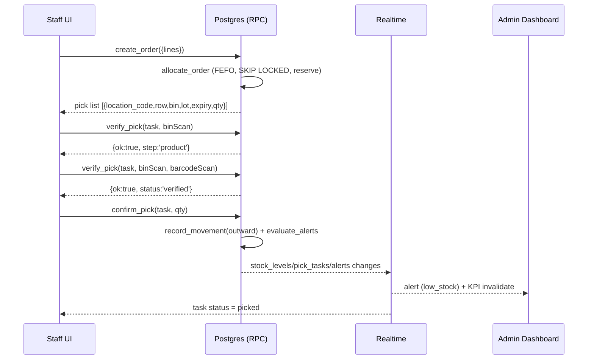

# App Flow Document
## BinTrack — Screens, navigation, and step-by-step flows

Related: `01-PRD.md`, `04-UI-UX-DESIGN.md`

---

## 1. Screen map

```
/login ──────────────────────────────────────────────────────┐
/signup                                                      │
/forgot-password                                             │
                                                             ▼
┌──────────────── App shell (sidebar + topbar + global search + bell) ────────────────┐
│                                                                                     │
│  STAFF (and admin)                        ADMIN ONLY                                │
│  /                 Home / quick actions   /admin               Live dashboard       │
│  /search           Product lookup         /admin/alerts        Alert centre         │
│  /products/:id     Product detail         /admin/products      Product management   │
│  /orders           Orders list            /admin/products/new  Add product          │
│  /orders/new       Order intake           /admin/locations     Rows & bins          │
│  /orders/:id       Pick list + scan       /admin/import        CSV import           │
│  /receive          Inward stock           /admin/export        CSV export           │
│  /transfer         Bin-to-bin transfer    /admin/expiry        Expiry manager       │
│  /scan             Scanner hub            /admin/counts        Cycle counts         │
│  /movements        Movement log (read)    /admin/users         Users & roles        │
│  /counts/:id       Count entry            /admin/settings      Thresholds, theme    │
│  /profile          Profile & theme        /admin/labels        Label printing       │
└─────────────────────────────────────────────────────────────────────────────────────┘
```

Route guards:
- Unauthenticated → `/login`.
- `staff` hitting `/admin/*` → redirected to `/` with toast "Admin access required".
- Deactivated user → signed out with message.

## 2. Global navigation

| Element | Behaviour |
|---|---|
| **Sidebar** (collapsible; icons on mobile bottom bar) | Items filtered by role. Active route highlighted. |
| **Global search** (`/` shortcut) | Type ≥ 2 chars → dropdown of products with total available and top 3 locations. Enter → product detail. Scanning a barcode here (HID scanner types + Enter) jumps straight to product. |
| **Scan button** (camera icon, always visible on mobile) | Opens scanner sheet. Result routing: bin QR → bin detail; product barcode → product detail. |
| **Notification bell** (admin) | Unread active alerts count; dropdown shows latest 10; "View all" → `/admin/alerts`. Live via Realtime. |
| **Theme toggle** | light / dark / system. Persisted in `localStorage` and `profiles.preferences`. |
| **User menu** | Profile, sign out. |

## 3. Authentication flows

### 3.1 Sign up (first user)
1. `/signup` → email, password, full name → `supabase.auth.signUp`.
2. Trigger creates `profiles` row with `role='staff'`.
3. Redirect to `/` (email confirmation if enabled).
4. First admin is promoted via SQL or Studio (see README). Thereafter admins promote via `/admin/users`.

### 3.2 Sign in
1. `/login` → email + password (or magic link).
2. On success, load `profiles` (role, is_active, preferences) into auth store.
3. Route to `/admin` for admins, `/` for staff.

### 3.3 Session
- supabase-js auto-refreshes tokens. On `SIGNED_OUT` / `TOKEN_REFRESHED` events, re-fetch profile.
- Role change by admin → `set_user_role` updates JWT app_metadata; user's next refresh picks it up; UI shows banner "Your role changed, reloading".

## 4. Staff flows

### 4.1 Instant product search
```
[Search bar] --type "blue mug"--> debounce 200ms --> rpc search_products(q)
   --> dropdown: name · SKU · available/on-hand · chips: WH1-R02-B017 (12), WH1-R03-B004 (5, exp 2026-10-01)
   --Enter/click--> /products/:id
```
Product detail page:
- Header: image, name, SKU, barcode, category, perishable badge.
- KPI strip: On hand / Reserved / Available / Reorder point.
- **Locations table**: location code, row, bin, lot, expiry (colour-coded), quantity, reserved. Sorted expiry ↑ then row/bin. Row click → bin detail. Buttons: "Transfer from here", "Print label".
- Movements tab: last 50 movements for this product.
- Empty state: "Not stocked anywhere" + (admin) "Receive stock".

### 4.2 Order intake → instant locations
```
/orders/new
  1. Header: order number (auto ORD-YYYYMMDD-####), customer (optional), source (manual)
  2. Lines: product picker (same search) + qty; add many; also "Paste CSV" (sku,qty)
  3. [Create & allocate] --> rpc create_order(jsonb)
  4. Response = pick list --> navigate /orders/:id
```
Pick list page (`/orders/:id`):
- Status chip (allocated / partially_allocated / picking / picked / shipped).
- Grouped by **Row** in walking order; each task card: product, location code (large), lot/expiry, qty to pick, status.
- Short lines shown in amber with "available X of Y".
- Buttons: **Start picking** (sets status `picking`, joins presence), **Scan to verify**, **Complete order**.

### 4.3 Scan-verify pick
```
Task card [Scan] --> Scanner sheet opens (camera or HID input)
  Step 1 "Scan bin"      --> decode --> rpc verify_pick(task, scanned_bin, null)
        ok? show green bin check, advance     | mismatch: red "Wrong bin. Expected WH1-R02-B017, scanned WH1-R02-B018" [Retry]
  Step 2 "Scan product"  --> decode --> rpc verify_pick(task, scanned_bin, scanned_barcode)
        ok? status=verified, qty stepper prefilled | mismatch: "Wrong product" / "Lot expired — pick blocked"
  Step 3 [Confirm qty]   --> rpc confirm_pick(task, qty)
        --> outward movement, reservation released, task=picked, card turns green, next task auto-focused
```
- Two mismatches on one task → `pick_discrepancy` alert to admins (live).
- Admin-only "Override without scan" requires reason → logged.
- When all tasks picked → order status `picked`; [Mark shipped] → `shipped`.
- Offline: scans queue locally and replay when back online (idempotent by task id).

### 4.4 Receive stock (inward)
```
/receive
  1. Scan/select product
  2. Quantity, lot number (optional), expiry date (REQUIRED if perishable; default = today + shelf_life_days)
  3. Destination bin: scan bin QR or pick from list (suggested: bins already holding this product with free capacity)
  4. [Receive] --> rpc record_movement('inward', ...) --> toast "50 × Blue Mug placed in WH1-R01-B003"
  5. Stock + dashboard update live; alerts re-evaluated (low_stock may auto-resolve)
```

### 4.5 Transfer between bins
```
/transfer
  Scan source bin --> list its stock --> choose product/lot --> qty --> scan destination bin --> [Transfer]
  rpc record_movement('transfer', from, to, qty, lot, expiry)
```
Validation: qty ≤ available in source; destination active; capacity warning (non-blocking, raises alert if exceeded).

### 4.6 Scanner hub (`/scan`)
Single page: big camera view + manual input. Decoded value → resolves to bin (location_code) or product (barcode/SKU) → shows quick card with actions (View, Receive here, Transfer from here, Count).

### 4.7 Movement log (`/movements`)
Filter by type, product, bin, actor, date. Infinite scroll. Export CSV (respects filters).

### 4.8 Cycle count entry (`/counts/:id`)
Admin opens a session for a row; staff walks the row: scan bin → list expected products → enter counted qty (or scan product then qty) → submit line. Variance shown after admin approval.

## 5. Admin flows

### 5.1 Live dashboard (`/admin`)
Layout:
1. **KPI row** (8 tiles) — live.
2. **Stock by row** bar chart + **bin utilisation heat-map** (grid per row; colour = fill %). Click row → filtered stock table.
3. **Alert feed** (right column) — newest first, severity colour bar, actions inline (Ack / Snooze / Resolve).
4. **Orders in progress** with presence avatars.
5. **Recent movements** stream.
6. **Expiring soon** mini-table (next 30 days).

Realtime: subscribes to `alerts`, `stock_levels`, `orders`, `pick_tasks`, `stock_movements`; KPI queries invalidated (debounced).

### 5.2 Alert centre (`/admin/alerts`)
Tabs: Active · Snoozed · Resolved. Filters by type/severity/product. Bulk acknowledge. Each alert: title, message, product/bin links, first seen, last evaluated, actions.
Settings link → thresholds.

### 5.3 Product management (`/admin/products`)
Table (server-side pagination, search, category filter, status). Row actions: edit, deactivate, print barcode, view locations.
`/admin/products/new`: form — SKU (unique check live), name, description, category, barcode (scan to fill), unit, unit cost, reorder point / qty, **perishable toggle → shelf-life days**, image upload. Save → optional "Receive opening stock now" shortcut.

### 5.4 Locations (`/admin/locations`)
Tree: Warehouse → Rows → Bins. Add row (code, name, sort order). Add bins in bulk ("B001–B040"). Edit capacity, deactivate. Print row's bin QR labels. Bin detail drawer: contents, utilisation, movements.

### 5.5 CSV import (`/admin/import`)
```
1. Choose type: Products | Bins | Opening stock | Orders   [Download template]
2. Drag-drop CSV --> client parses header + first 20 rows --> preview + column mapping (auto-matched)
3. Client-side zod validation preview (errors highlighted)
4. Mode: Partial (skip bad rows) | Strict (all-or-nothing)
5. [Import] --> upload to Storage imports/{job_id}.csv --> invoke edge function csv-import
6. Progress bar live from import_jobs (Realtime): processed / total, success / errors
7. Result: summary + downloadable error CSV (row, column, message)
```

### 5.6 CSV export (`/admin/export`, and Export buttons on grids)
Pick dataset + filters → `export_rows` RPC → client builds CSV (PapaParse unparse) → download. Large exports (> 20k rows) go via Edge Function to Storage with a signed URL.

### 5.7 Expiry manager (`/admin/expiry`)
Buckets: Expired · ≤ 7d · ≤ 30d · ≤ 60d. Table of lots with location & qty. Actions: Write-off (adjustment with reason), Mark quarantined, Move to clearance bin. Chart: units expiring per week.

### 5.8 Cycle counts (`/admin/counts`)
Create session (row or bins, blind/unblind) → assign → monitor progress → review variances → Approve (creates `count_correction` movements) or Recount.

### 5.9 Users & roles (`/admin/users`)
List profiles; invite by email (Supabase invite); change role (confirm dialog); deactivate. Cannot demote self if last admin.

### 5.10 Settings (`/admin/settings`)
Thresholds (expiry warning days, dead-stock days, default reorder point), warehouse defaults, serpentine picking toggle, email digest opt-in, theme.

### 5.11 Labels (`/admin/labels`)
Choose bins (row) or products → preview → Edge Function generates PDF (A4 sheets, 3×8) → open/print.

## 6. Cross-cutting flows

### 6.1 Realtime propagation
```
Staff confirms pick --> DB: stock_levels update + stock_movements insert + alerts upsert
   --> Realtime broadcasts to:
        Admin dashboard: KPI invalidate, movement stream row, alert toast + bell +1
        Any open product page for that product: locations table refresh
        Other pickers on same order: task card turns green
```

### 6.2 Notification lifecycle
`active` → (admin views dropdown) `alert_reads` row → (Ack) `acknowledged` → auto `resolved` when condition clears, or manual resolve. `snoozed` re-activates after `snooze_until`.

### 6.3 Error states
- Insufficient stock → inline message with available qty and link to product locations.
- Camera permission denied → fallback to manual entry + HID scanner hint.
- Realtime disconnected → yellow banner "Live updates paused, reconnecting…"; data still loads via polling every 30 s.

## 7. Sequence diagram — order intake to pick


